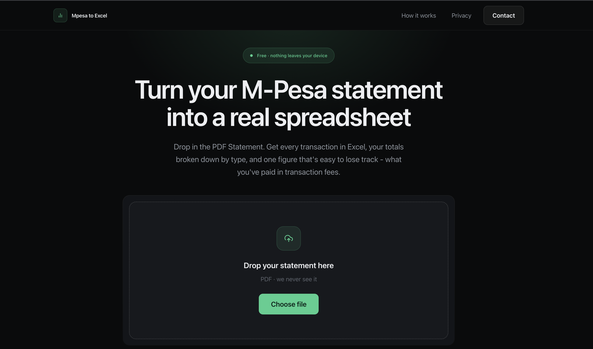

# Mpesa to Excel

Convert an M-Pesa PDF statement into a clean Excel file — every transaction, your
monthly totals, and what you paid in transaction fees. The statement is never
uploaded: parsing and spreadsheet generation both happen in the browser.

**[Live site →](https://m-pesa-expense-tracker.vercel.app/)**



## Why

M-Pesa statements arrive as PDFs, which are useless for budgeting or
reconciliation. The usual workaround is retyping rows into a spreadsheet by hand.
This does it in a few seconds, and adds up the transaction charges along the
way — a figure most people have never seen totalled for a whole year.

## Features

- Drop in a PDF, get every transaction as a formatted `.xlsx`
- On-screen summary: money in and out, net movement, closing balance
- Spend broken down by calendar month
- Total transaction charges, and what share of your spending they represent
- Two-sheet workbook: a summary sheet and a filterable transactions sheet
- Files are named after the statement's own date range, so months don't overwrite
  each other
- No account, no upload, no limit

## Privacy

There is no server-side processing and no database. `pdfjs-dist` reads the PDF in
the browser, the parsed rows live in memory for the length of the session, and
ExcelJS builds the workbook client-side before handing it to the browser as a
blob. Closing the tab ends it. Nothing about a statement is logged or
transmitted.

## Tech

- **Next.js 15** (App Router) and **React 19**
- **TypeScript** for components and state, plain JS for the parsing and
  spreadsheet utilities
- **Tailwind CSS 4** with design tokens defined in `globals.css`
- **Zustand** for state
- **pdfjs-dist** for in-browser PDF text extraction
- **ExcelJS** for workbook generation
- Deployed on **Vercel**

## How it works

1. `useExtractText` loads the PDF with `pdfjs-dist` and pulls out its text layer.
2. `mpesaParser.js` matches the statement's summary block and transaction rows,
   returning structured rows plus a `diagnostics` object describing the shape of
   anything it could not read — counts only, never content.
3. `summarise.js` aggregates those rows into totals, per-month figures and the
   charge total. It is the single source for both the on-screen summary and the
   workbook, so the two can never disagree.
4. `exportToExcel.js` builds the two-sheet workbook and triggers the download.

## Running locally

```bash
git clone https://github.com/esthercate/M-Pesa-expense-tracker.git
cd M-Pesa-expense-tracker/mpesa-expense-tracker
pnpm install
pnpm dev
```

Then open http://localhost:3000.

## Roadmap

- Support for password-protected statements (the ones Safaricom emails for
  periods longer than six months)
- Transaction charges broken down by type
- Optional, opt-in categorisation of merchants using AWS Bedrock — sending only
  deduplicated merchant names, never amounts, dates or phone numbers

## Author

Catherine Vuthi — frontend engineer in Nairobi.

- [GitHub](https://github.com/esthercate)
- [LinkedIn](https://www.linkedin.com/in/catherine-esther-vuthi/)

## License

MIT — see [LICENSE](LICENSE).